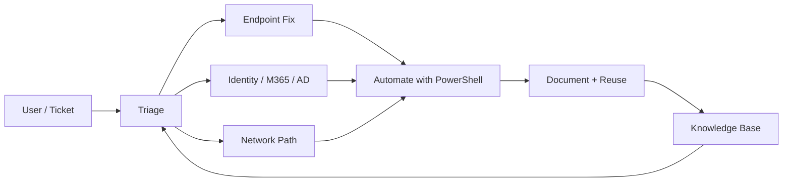

<div align="center">


```text
┌──────────────────────────────────────────────────────────────────────┐
│  UPLINK  ● LIVE    SECTOR: EARTH-LA    LATENCY: 0.42ms    YEAR 4526 │
│  OPERATOR: kdrcoding    CLEARANCE: SUPPORT / SYSADMIN / NET-OPS     │
│  STATUS: OPEN TO MISSIONS    SIGNAL: STRONG    ENTROPY: LOW         │
└──────────────────────────────────────────────────────────────────────┘
```


[](https://kdrcoding.com)
[](https://linkedin.com/in/kadir-ravshanov-961994187)
[](https://t.me/imkadi)
[](https://github.com/kdrcoding)


</div>

---

## `01` // OPERATOR BRIEF

> **Transmission from Cycle 4526:** Earth still needs people who can keep machines honest. I do that work now.

I am **Kadir Ravshanov**, an **IT Support Specialist** and **Junior Systems Administrator** in **Los Angeles**. I fix endpoints, accounts, apps, networks, and cloud services, then leave behind scripts and docs so the next incident is shorter.

<table>
<tr>
<td width="50%">

### Core directives
- Restore Windows fleets, printers, peripherals, and user sessions
- Administer Active Directory, Microsoft 365, identity, and permissions
- Run ticket workflows with clear notes and remote assistance
- Diagnose TCP/IP, DNS, DHCP, VPN, Wi-Fi, LAN/WAN, VLAN issues
- Automate repeat work with PowerShell, Bash, and CLI tooling
- Operate cloud, virtualization, web hosting, and deploy paths

</td>
<td width="50%">

### Operator traits
| Field | Value |
|---|---|
| Languages | English · Uzbek · Russian · Turkish |
| Base | Santa Monica / Los Angeles, CA |
| Mode | Practical fixes + clean documentation |
| Focus | Windows Server · GPO · Networking · Security+ |
| Signal | Open to support / sysadmin / net-ops roles |

</td>
</tr>
</table>

---

## `02` // CAPABILITY MATRIX

<details open>
<summary><b>▸ Layer A — Support & Directory Ops</b></summary>
<br/>


</details>

<details open>
<summary><b>▸ Layer B — Network & Defense Grid</b></summary>
<br/>


</details>

<details open>
<summary><b>▸ Layer C — Cloud Fabric & Automation</b></summary>
<br/>


</details>

<details open>
<summary><b>▸ Layer D — Web Stack & Data Channels</b></summary>
<br/>


</details>

<details>
<summary><b>▸ Layer E — Field Diagnostics</b></summary>
<br/>


</details>

---

## `03` // SYSTEMS ARCHITECTURE



| Module | Function | Output |
|---|---|---|
| **Incident Recovery** | Reproduce, isolate, restore | User back online fast |
| **Directory Control** | Accounts, groups, access | Clean identity state |
| **Packet Pathfinding** | DNS / DHCP / VPN / LAN checks | Stable connectivity |
| **Script Forge** | PowerShell + Bash playbooks | Fewer repeat tickets |
| **Cloud Relay** | Azure / AWS / GCP / Cloudflare | Services stay reachable |
| **Human Channel** | Clear writing, training, multilingual support | Teams stay aligned |

---

## `04` // DEPLOYED MODULES

<table>
<tr>
<td width="50%" valign="top">

### ⌁ [Windows Support Scripts](https://github.com/kdrcoding/windows-support-scripts)
Help-desk diagnostics, network checks, and Windows recovery tasks on demand.

`PowerShell` · `Windows CLI`

</td>
<td width="50%" valign="top">

### ⌁ [IT Troubleshooting Notes](https://github.com/kdrcoding/it-troubleshooting-notes)
Repeatable procedures, known fixes, and deployment notes for real support work.

`Markdown` · `Runbooks`

</td>
</tr>
<tr>
<td width="50%" valign="top">

### ⌁ [Job Application Tracker](https://github.com/kdrcoding/job-application-tracker)
Offline tracker for applications, contacts, and follow-ups. No backend required.

`HTML` · `CSS` · `JavaScript`

</td>
<td width="50%" valign="top">

### ⌁ [WordPress Translation Workflow](https://github.com/kdrcoding/translate-wordpress-web)
Localization cleanup pipeline for WordPress sites and translation passes.

`WordPress` · `PowerShell` · `Bash`

</td>
</tr>
</table>

<div align="center">

[](https://github.com/kdrcoding?tab=repositories)

</div>

---

## `05` // TELEMETRY FEED

<div align="center">


</div>

---

## `06` // MISSION QUEUE

```text
[ ] Earn CompTIA Security+
[ ] Expand Windows Server · AD · GPO · networking labs
[ ] Ship more reusable PowerShell / support tools
[ ] Build cloud, security, and sysadmin practice projects
[ ] Keep documentation and troubleshooting workflows sharp
```

| Priority | Target | Horizon |
|---|---|---|
| P0 | Security+ certification | Near-term |
| P1 | Deeper Windows Server / AD labs | Active |
| P2 | Public tooling for help-desk teams | Ongoing |
| P3 | Cloud + security project builds | Ongoing |

---

## `07` // OPEN CHANNEL

<div align="center">

```text
AVAILABLE FOR:
IT Support · Help Desk · Desktop Support · Technical Support
Junior Systems Administration · Network Support · Technical Operations
```

[](https://kdrcoding.com)
[](https://linkedin.com/in/kadir-ravshanov-961994187)
[](https://t.me/imkadi)
[](https://github.com/kdrcoding)

<br/>


<sub>KDR Coding · Operator console aesthetic · Metrics auto-sync daily via GitHub Actions</sub>

</div>
